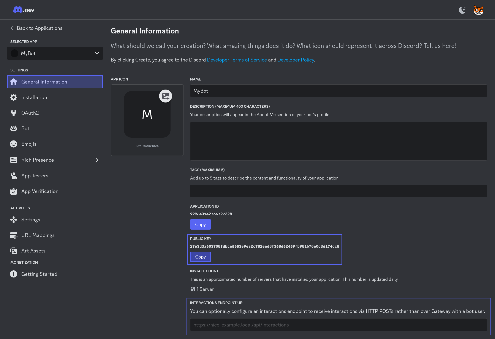

# Handling HTTP Interactions with ASP.NET Core

This guide will show you how to receive and handle Discord interactions, like slash commands and button clicks, through HTTP requests using the [NetCord.Hosting.AspNetCore](https://www.nuget.org/packages/NetCord.Hosting.AspNetCore) package. This ASP.NET Core package can be effortlessly integrated with [NetCord.Hosting.Services](https://www.nuget.org/packages/NetCord.Hosting.Services) to handle these HTTP interactions in C# easily. Additionally, you can implement your own @NetCord.Hosting.IHttpInteractionHandler to manually handle HTTP interactions received from Discord, giving you full control over your bot's behavior.

## Required Dependencies

Before you get started, ensure that you've installed the necessary native dependencies. Follow the [installation guide](installing-native-dependencies.md) to set them up.

## Setting Up HTTP Interactions in C#

To handle HTTP interactions from Discord in your bot, you need to use @NetCord.Hosting.Rest.RestClientServiceCollectionExtensions.AddDiscordRest* to add the @NetCord.Rest.RestClient and then call @NetCord.Hosting.AspNetCore.EndpointRouteBuilderExtensions.UseHttpInteractions* to map the HTTP interactions route.

[!code-cs[Program.cs](HttpInteractions/Program.cs?highlight=10,18)]

### Receiving HTTP Interactions via HTTP Interaction Handler

You can also create your own @NetCord.Hosting.IHttpInteractionHandler to handle HTTP interactions manually. This allows you to have full control over the behavior of your bot when receiving HTTP interactions. You register them using @"NetCord.Hosting.HttpInteractionHandlerServiceCollectionExtensions.AddHttpInteractionHandler``1(Microsoft.Extensions.DependencyInjection.IServiceCollection)?text=AddHttpInteractionHandler".

[!code-cs[HttpInteractionHandler.cs](HttpInteractions/HttpInteractionHandler.cs#L6-L14)]

## Configuring Your Discord Bot for HTTP Interactions

To make your bot receive HTTP interactions from Discord, you need to store the public key in the configuration and specify the endpoint URL in the [Discord Developer Portal](https://discord.com/developers/applications).

{width=850px}

### Specifying the Public Key in the Configuration

You can for example use `appsettings.json` file for configuration. It should look like this:
[!code-json[appsettings.json](HttpInteractions/appsettings.json?highlight=4)]

### Specifying the Interactions Endpoint URL

If your bot is hosted at `https://example.com` and you have specified `/interactions` pattern in @NetCord.Hosting.AspNetCore.EndpointRouteBuilderExtensions.UseHttpInteractions*, the endpoint URL will be `https://example.com/interactions`. Also note that Discord sends validation requests to the endpoint URL, so your bot must be running while updating it.

For local testing, you can use [ngrok](https://ngrok.com), a tool that exposes your local server to the internet, providing a public URL to receive interactions. Use the following command to start ngrok with a correct port specified:
```bash
ngrok http http://localhost:port
```

It will generate a URL that you can use to receive HTTP interactions from Discord. For example, if the URL is `https://random-subdomain.ngrok-free.app` and you have specified `/interactions` pattern in @NetCord.Hosting.AspNetCore.EndpointRouteBuilderExtensions.UseHttpInteractions*, the endpoint URL will be `https://random-subdomain.ngrok-free.app/interactions`.

## Extending Your HTTP Interactions Bot

Now, as you have your bot up and running, you can start adding more features to it. You can use the following guides to learn more about the features you can add to your HTTP interactions based bot:

- **@"application-commands?text=Application Commands":** Learn how to make complex commands with parameters and subcommands with ease.
- **@"component-interactions?text=Component Interactions":** Make your HTTP interactions bot interactive with buttons, select menus, and other components easily.
