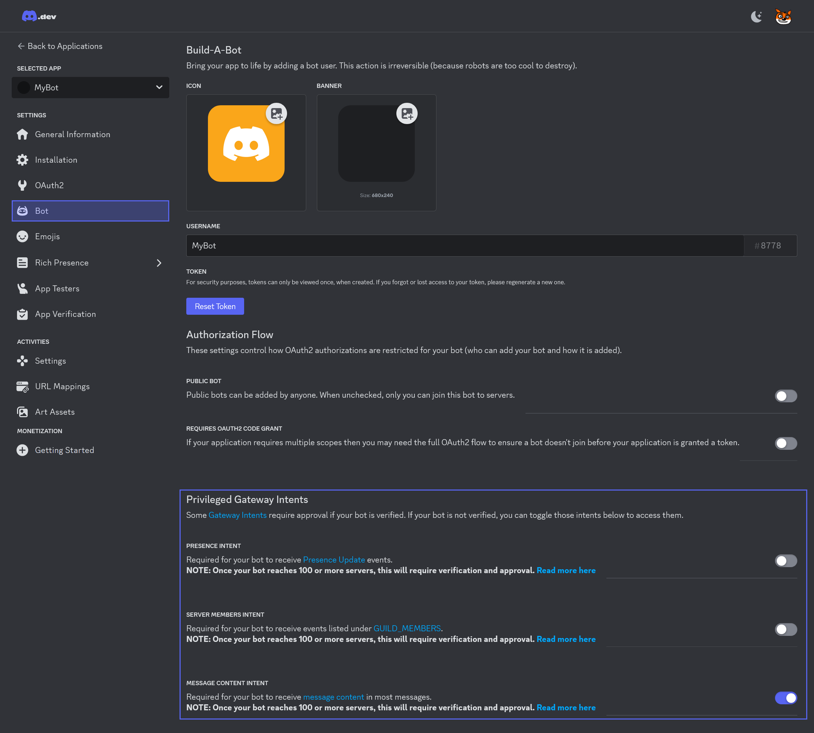

# Intents

## What are intents?
Intents allow you to subscribe Discord events, such as @NetCord.Gateway.GatewayClient.MessageCreate and @NetCord.Gateway.GatewayClient.GuildUserAdd. If you don't specify certain intent, you will not subscribe certain events.

## Privileged intents
Privileged intents are intents that you need to enable in [Discord Developer Portal](https://discord.com/developers/applications).


## How to specify intents in NetCord?
Intents in NetCord are handled by @NetCord.Gateway.GatewayIntent.
You specify them like this:
```cs
GatewayClient client = new(new Token(TokenType.Bot, "Token from Discord Developer Portal"), new GatewayClientConfig()
{
	Intents = GatewayIntent.GuildMessages | GatewayIntent.DirectMessages | GatewayIntent.MessageContent
});
```

> [!WARNING]
> `GatewayIntent.MessageContent` is a privileged intent.

If you made this, you receive guild and direct messages.

> [!NOTE]
> `GatewayIntent.MessageContent` is a special intent that allows you to get @NetCord.Rest.RestMessage.Content of message on events. Otherwise it is empty.