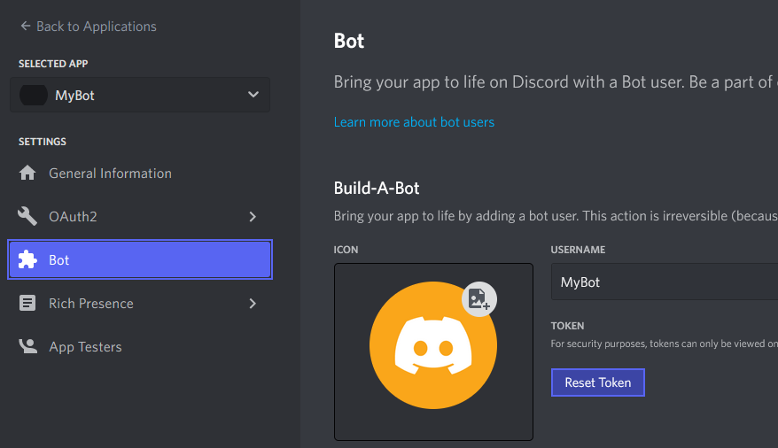
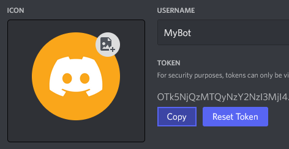

# Coding!

> [!Note]
> This section assumes that you have a project with NetCord installed and you have a bot created. If not, go back!

Before we start, you need a token of your bot... so you need to go to [Discord Developer Portal](https://discord.com/developers/applications) and get it.

> [!IMPORTANT]
> You should never give your token to anybody.

## [Hosting](#tab/hosting)

With hosting, you can just use @NetCord.Hosting.Gateway.GatewayClientHostBuilderExtensions.UseDiscordGateway(Microsoft.Extensions.Hosting.IHostBuilder) to add your bot to the host. Quite easy, right?
[!code-cs[Program.cs](CodingHosting/Program.cs)]

Also note that the token needs to be stored in the configuration. You can for example use `appsettings.json` file. It should look like this:
[!code-json[appsettings.json](CodingHosting/appsettings.json)]

Now, when you run the code, your bot should be online!

## [Without Hosting](#tab/without-hosting)

Add the following lines to file `Program.cs`.
[!code-cs[Program.cs](Coding/Program.cs#L1-L4)]

Logging is important, because of it you know what is your bot doing. To add it, add the following lines to your code.
[!code-cs[Program.cs](Coding/Program.cs#L6-L10)]

Now it's time to finally... make the bot online! To do it, add the following lines to your code.
[!code-cs[Program.cs](Coding/Program.cs#L12-L13)]

Now, when you run the code, your bot should be online!

### The Final Product
[!code-cs[Program.cs](Coding/Program.cs)]