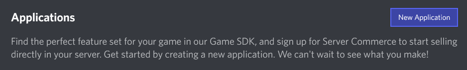
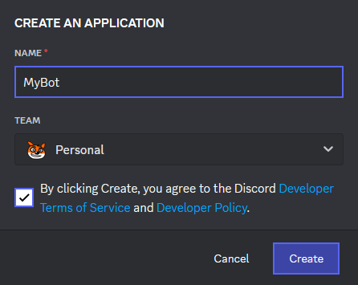
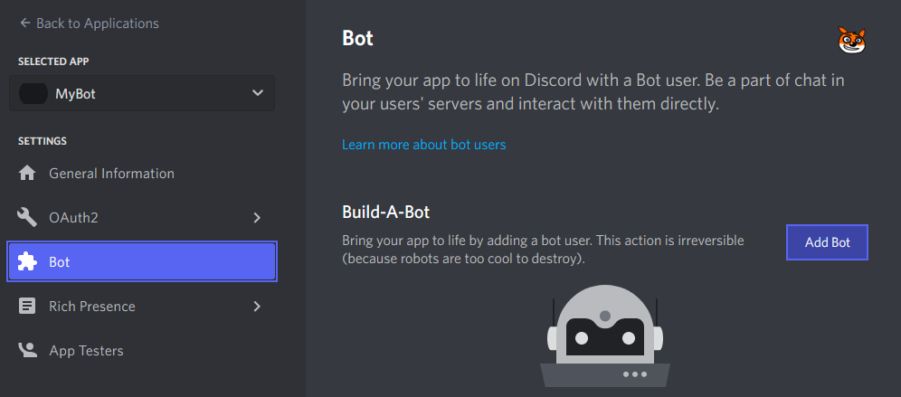
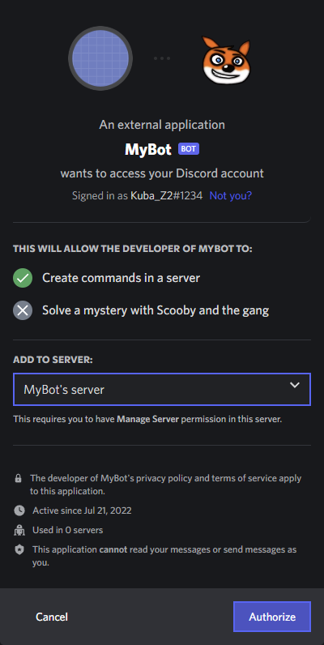

# Creating a First Bot!

1. Go to [Discord Developer Portal](https://discord.com/developers/applications).
2. Create an app.

3. Create a bot.

4. Add the bot to a server. Copy a link, and then paste the link to a browser and add the bot!

