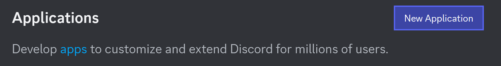
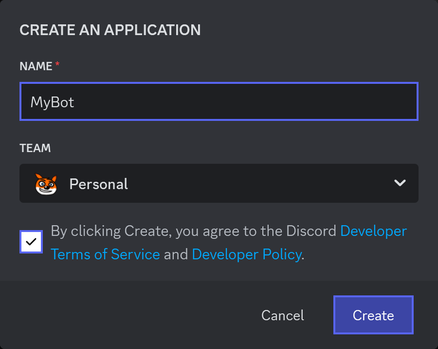
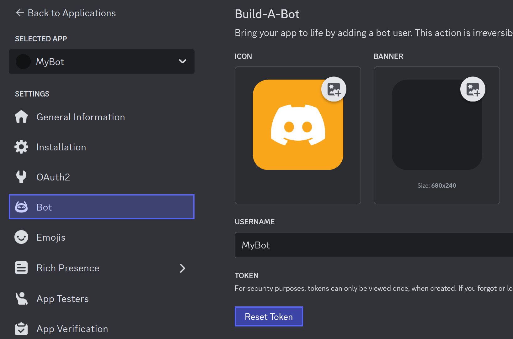
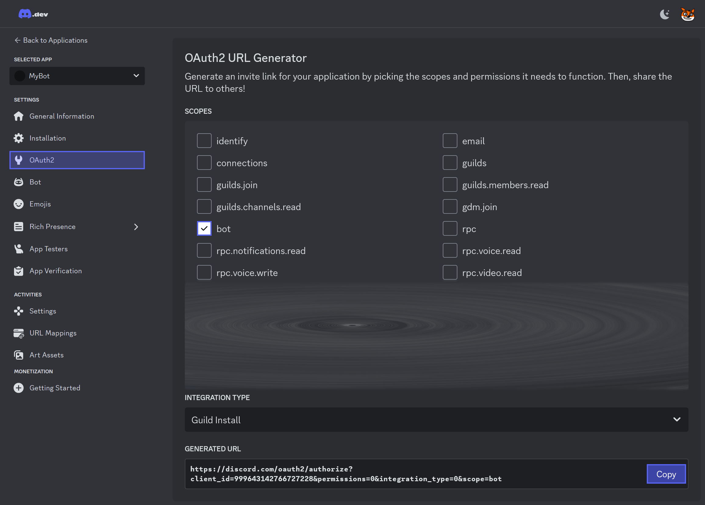
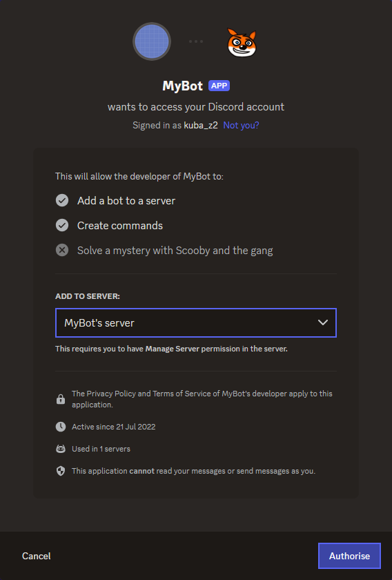

# Creating Your Bot

Before you can write any code, you need to register your application with Discord and get a bot token. This guide walks you through the Discord Developer Portal to set everything up.

> [!IMPORTANT]
> Never share your bot token with anyone! It grants complete control over your bot. Treat it like a password.

## Step 1: Create an Application {#create-application}

1. Go to the [Discord Developer Portal](https://discord.com/developers/applications)

2. Click the **New Application** button in the top right

   

3. Enter a name for your application (this is what will appear in Discord)

   

4. Click **Create** and accept the terms

Congratulations! You've created your first Discord application. Now you need to add a bot user to it.

## Step 2: Add a Bot User {#add-bot-user}

1. In the left sidebar, click **Bot**

2. Click **Add Bot** to create a bot user for your application

3. Under the bot's username, you'll see **TOKEN**. This is what your code will use to authenticate with Discord.

## Step 3: Get Your Bot Token {#get-bot-token}

Your bot token is a secret key that authenticates your bot with Discord.

1. In the **Bot** section, find the **TOKEN** field

2. Click **Copy** to copy your token to the clipboard

   

3. **Store it safely** - you'll need it in your code

> [!WARNING]
> Keep your token private! Anyone with your token can:
> - Control your bot completely
> - Perform any action your bot can perform
> - Access any data your bot can access
> 
> If you suspect your token has been compromised, click **Regenerate** to invalidate the old token immediately.

### Token Storage Best Practices {#token-storage}

**Never** commit your token to source control. Instead:

- **Local Development:** Store in `appsettings.Development.json` (keep `appsettings.json` with placeholders checked in, and add `appsettings.Development.json` to `.gitignore`) or use environment variables
- **Production:** Use secrets management (Azure Key Vault, AWS Secrets Manager, environment variables)
- **Docker:** Use environment variables passed at runtime

## Step 4: Invite Your Bot to a Server {#invite-bot-to-server}

Before your bot can do anything, it needs to join a Discord server where you're testing.

1. In the left sidebar, click **OAuth2** → **URL Generator**

2. Under **Scopes**, select:
   - `bot` - Allows your bot to join the server

3. Under **Permissions**, select the permissions your bot needs. For testing, start with:
   - `Send Messages`
   - `Read Messages/View Channels`
   - `Read Message History`

   > [!NOTE]
   > You can always come back and add more permissions later. Only request what your bot actually needs.

4. Copy the generated URL and open it in your browser

   

5. Select a server you own and click **Authorize**

6. Complete the CAPTCHA if prompted

   

Your bot is now in the server! However, it's not running yet.

## Step 5: Verify Bot Status {#verify-bot-status}

1. Go back to the Developer Portal and click **Bot**

2. Enable the following **Privileged Gateway Intents** based on what your bot needs:
   - `Message Content Intent` - To read message content
   - `Server Members Intent` - To see member information
   - `Presence Intent` - To track user online status

> [!NOTE]
> You only need to enable intents for features your bot actually uses. For now, enabling **Message Content Intent** is sufficient for most bots.

3. Look for "Your bot is offline" status - this is normal until you start your bot code

   

## What's Next? {#whats-next}

Now that your bot is registered and invited to a server, you're ready to:

1. Set up your .NET project
2. Write your first bot code
3. Run it and see your bot come online

---

## Navigation

← **Previous:** [Installation](installation.md) | **Next:** [Project Setup](project-setup.md) →

## See Also

- [Working with Guilds](../discord-entities/guilds.md) - Manage servers where your bot operates
- [Gateway Intents](../events/gateway-events.md) - Configure what events your bot receives
- [Discord Developer Portal](https://discord.com/developers/applications) - Official bot management

