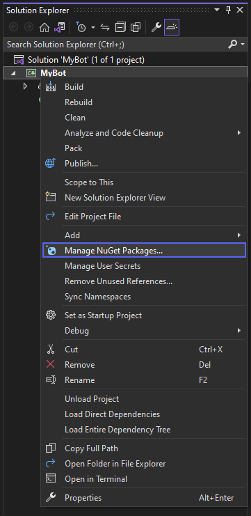
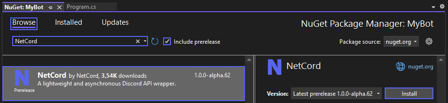
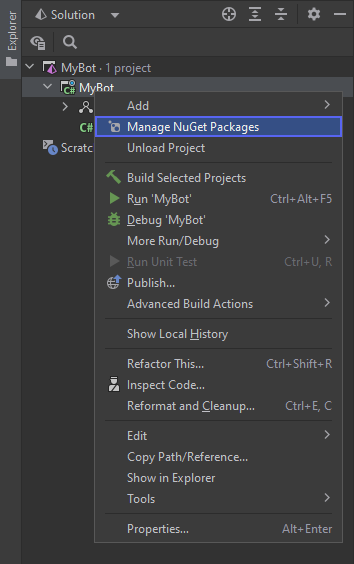

# Installing NetCord

This guide will walk you through the process of installing NetCord packages using various tools like the .NET CLI, Visual Studio and JetBrains Rider.

> [!NOTE]
> NetCord requires [.NET 8](https://dotnet.microsoft.com/download/dotnet/8.0) or higher. Older versions are not supported.

## [.NET CLI](#tab/dotnet-cli)

To install the NetCord package using the .NET CLI, run the following command:
```bash
dotnet add package NetCord --prerelease
```

## [Visual Studio](#tab/visual-studio)

To install the NetCord package using the Visual Studio UI, follow these steps:

1. Create a new project.

2. Click `Manage NuGet Packages`.

   

3. Browse and install `NetCord` package.

   > [!NOTE]
   > The `Include prerelease` checkbox must be checked to see the package.

   

## [JetBrains Rider](#tab/rider)

To install the NetCord package using JetBrains Rider UI, follow these steps:

1. Create a new project.

2. Click `Manage NuGet Packages`.

   

3. Browse and install `NetCord` package.

   > [!NOTE]
   > The `Prerelease` checkbox must be checked to see the package.

   

## [Other](#tab/other)

To install the NetCord package using other tools, see the instructions on [NuGet](https://www.nuget.org/packages/NetCord).

***

Other packages can be installed in the same way.

### List of Packages

| Package                                                                                     | Description                                                                  |
|---------------------------------------------------------------------------------------------|------------------------------------------------------------------------------|
| **[NetCord](https://www.nuget.org/packages/NetCord)**                                       | Core package with fundamental functionality.                                 |
| **[NetCord.Services](https://www.nuget.org/packages/NetCord.Services)**                     | Facilitates seamless handling of commands and interactions.                  |
| **[NetCord.Hosting](https://www.nuget.org/packages/NetCord.Hosting)**                       | Provides .NET Generic Host extensions for the NetCord package.               |
| **[NetCord.Hosting.Services](https://www.nuget.org/packages/NetCord.Hosting.Services)**     | Provides .NET Generic Host extensions for the NetCord.Services package.      |
| **[NetCord.Hosting.AspNetCore](https://www.nuget.org/packages/NetCord.Hosting.AspNetCore)** | Provides ASP.NET Core extensions for seamless handling of HTTP interactions. |
