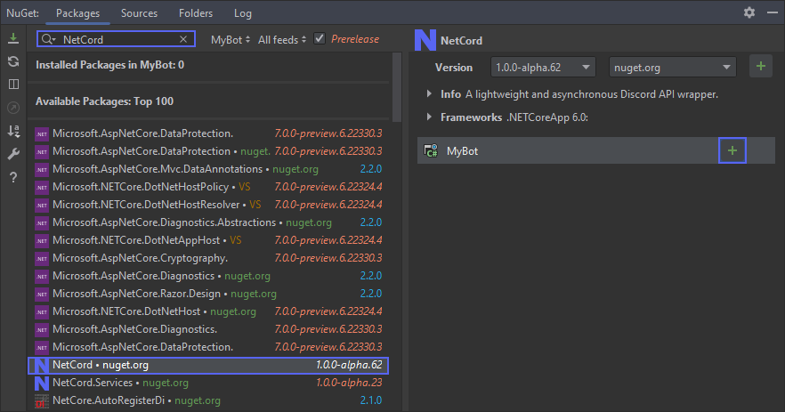

# Installing NetCord

> [!NOTE]
> NetCord requires [.NET 8](https://dotnet.microsoft.com/download/dotnet/8.0) or higher. Older versions are not supported.

## [Visual Studio](#tab/visual-studio)
1. Create a new project.
2. Click `Manage NuGet Packages`.

3. Browse and install `NetCord` package.

## [JetBrains Rider](#tab/rider)
1. Create a new project.
2. Click `Manage NuGet Packages`.

3. Browse and install `NetCord` package.

## [Other](#tab/other)
Follow instructions on [NuGet](https://www.nuget.org/packages/NetCord).

***

Other packages can be installed in the same way.

### List of packages

- [NetCord](https://www.nuget.org/packages/NetCord)
- [NetCord.Services](https://www.nuget.org/packages/NetCord.Services)
- [NetCord.Hosting](https://www.nuget.org/packages/NetCord.Hosting)
- [NetCord.Hosting.Services](https://www.nuget.org/packages/NetCord.Hosting.Services)
- [NetCord.Hosting.AspNetCore](https://www.nuget.org/packages/NetCord.Hosting.AspNetCore)