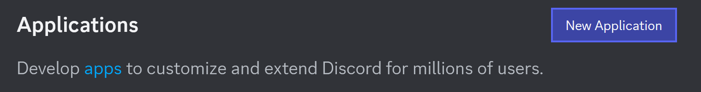

# Building Your First C# Discord Bot

Looking to build your first C# Discord bot? This step-by-step guide will show you how to create a bot on Discord and connect it to the Discord API using C# and NetCord, a powerful .NET library designed for building efficient and scalable Discord bots.

## Step 1: Setting Up Your Discord Bot on the Discord Developer Portal

Before diving into the code, you need to set up your bot on the Discord Developer Portal. This is the first essential step to making your bot available on Discord.

### Creating a Discord Bot Application

1. Head over to the [Discord Developer Portal](https://discord.com/developers/applications). Click **New Application** in the **Applications** section.
   {width=600px}

2. Enter a name for your bot, check the box, and click **Create**.
   {width=350px}

### Adding Your Bot to a Discord Server

Once your bot application is created, you need to invite it to a server to interact with users:

1. In the **OAuth2** section, select the **bot** scope to generate an invite link.
   {width=850px}

2. Use the generated invite link, paste it into your browser, select a server, and click **Authorise**.
   {width=400px}

### Retrieving Your Discord Bot Token

Before running the code, you'll need to retrieve your bot's token, which will allow your bot to communicate with Discord's API.

> [!IMPORTANT]
> Never share your bot token with anyone! It grants full control over your bot.

1. Go to the **Bot** section in the application settings and click **Reset Token**.
   {width=600px}

2. Copy the token and save it. You'll need it later to connect your bot to Discord.
   {width=350px}

## Step 2: Coding Your C# Discord Bot

Now that your bot is set up on Discord, it's time to write the C# code to bring your bot to life. In this section, you can select between two approaches for building your C# bot: using the **.NET Generic Host** or a **Bare Bones** setup.

### Choosing Between the .NET Generic Host and Bare Bones Approach

- **.NET Generic Host:** This approach allows you to set up your C# bot with ease, leveraging the power of dependency injection. It's straightforward and integrates well with the rest of the .NET ecosystem. You can read more about it [here](https://learn.microsoft.com/dotnet/core/extensions/generic-host).
- **Bare Bones:** For developers who prefer direct control, this approach lets you handle everything manually. It gives you more flexibility but requires a bit more setup.

Pick one based on your preference and project requirements.

### Writing the C# Code

#### [.NET Generic Host](#tab/generic-host)

> [!NOTE]
> The .NET Generic Host approach requires the following packages:
> - [Microsoft.Extensions.Hosting](https://www.nuget.org/packages/Microsoft.Extensions.Hosting)
> - [NetCord.Hosting](https://www.nuget.org/packages/NetCord.Hosting)

To set up the bot with the .NET Generic Host, simply use @NetCord.Hosting.Gateway.GatewayClientServiceCollectionExtensions.AddDiscordGateway*. Here's an example showing how to add the bot to the host.
[!code-cs[Program.cs](CodingHosting/Program.cs)]

For better configuration management, store the token in an `appsettings.json` file like this:
[!code-json[appsettings.json](CodingHosting/appsettings.json)]

#### [Bare Bones](#tab/bare-bones)

To create the @NetCord.Gateway.GatewayClient manually, add the following lines to your `Program.cs` file.
[!code-cs[Program.cs](Coding/Program.cs#L1-L4)]

Next, you can add logging to track your bot's activity.
[!code-cs[Program.cs](Coding/Program.cs#L6-L10)]

Finally, start your bot with the following lines.
[!code-cs[Program.cs](Coding/Program.cs#L12-L13)]

#### The Final Product
[!code-cs[Program.cs](Coding/Program.cs)]

***

Now, when you run the code, your C# bot should be online!

## Extending Your C# Discord Bot

Now, as you have your bot up and running, you can start adding more features to it. Here are some common functionalities you might want to implement:

- **@"application-commands?text=Application Commands":** Allow users to interact with your bot easily by creating slash commands, user commands, and message commands.
- **@"events?text=Events Handling":** Listen for and respond to various events, such as message creation or user joining a server.
