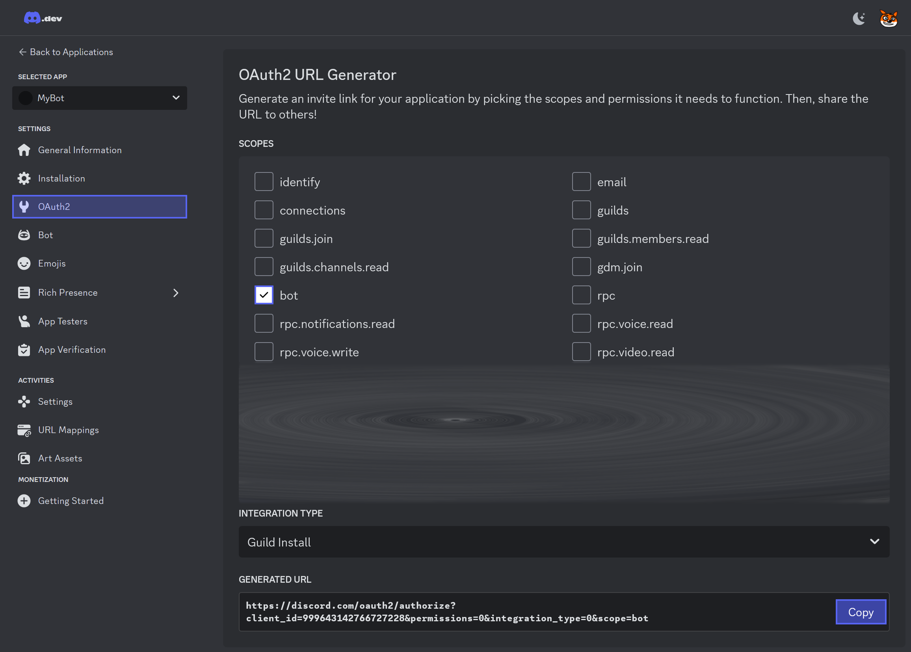

# Prerequisites for Writing a Discord Bot

Before you can start writing your awesome Discord bot in C#, there are a few key steps to follow, such as creating a bot, adding it to a server, and retrieving its token. This guide will walk you through each of these steps.

To begin, navigate to the [Discord Developer Portal](https://discord.com/developers/applications).

## 1. Creating a Discord Bot

1. In the **Applications** section, click on **New Application**.  
   {width=600px}

2. Fill in the name of your bot, check the checkbox, and then click **Create**.  
   {width=350px}

That's it! You have successfully created your Discord bot.

## 2. Adding Your Discord Bot to a Server

Now that your bot is created, let's add it to a server:

1. In your bot's settings, go to the **OAuth2** section and generate an invite link by selecting the **bot** scope. Then copy the generated link and paste it into your browser.
   {width=850px}

2. Select the server you want to add your bot to, and click **Authorise**.  
   {width=400px}

Done! Your bot is now part of the server.

## 3. Getting Your Discord Bot Token

> [!IMPORTANT]  
> Never share your bot token with anyone! It grants full control over your bot.

The bot token is crucial for connecting your C# Discord bot with the Discord API. Follow these steps to get the token:

1. Go to the **Bot** section in your application's settings and click **Reset Token**.  
   {width=600px}

2. After resetting, click **Copy** to copy the token to your clipboard.  
   {width=350px}

***

Now you have everything you need to start coding your Discord bot in C#. Let's get started!
