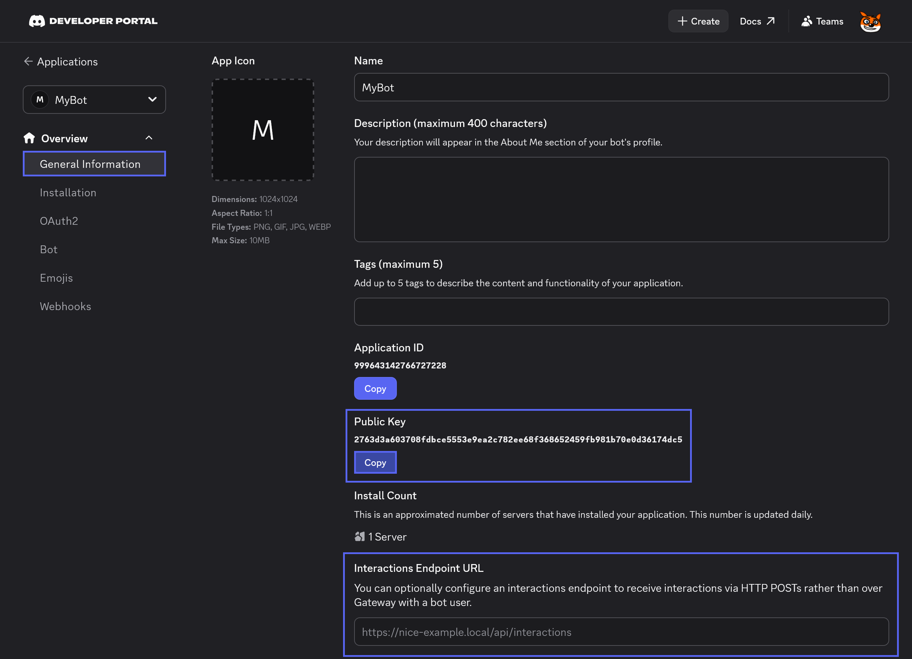

# Handling HTTP Interactions with ASP.NET Core

This guide will show you how to receive and handle Discord interactions, like slash commands and button clicks, through HTTP requests using the [NetCord.Hosting.AspNetCore](https://www.nuget.org/packages/NetCord.Hosting.AspNetCore) package. This ASP.NET Core package can be effortlessly integrated with [NetCord.Hosting.Services](https://www.nuget.org/packages/NetCord.Hosting.Services) to handle these HTTP interactions in C# easily. Additionally, you can implement your own @NetCord.Hosting.IHttpInteractionHandler to manually handle HTTP interactions received from Discord, giving you full control over your bot's behavior.

## Required Dependencies

Before you get started, ensure that you've installed the necessary native dependencies. Follow the [installation guide](../installing-native-dependencies.md) to set them up.

## Setting Up

To handle HTTP interactions from Discord in your bot, you need to use @NetCord.Hosting.Rest.RestClientServiceCollectionExtensions.AddDiscordRest* to add the @NetCord.Rest.RestClient and then call @NetCord.Hosting.AspNetCore.HttpEventEndpointRouteBuilderExtensions.UseHttpInteractions* to map the HTTP interactions route. You can also use @NetCord.Hosting.Services.ApplicationCommands.ApplicationCommandServiceServiceCollectionExtensions.AddHttpApplicationCommands* to add the application command service with preconfigured HTTP contexts to your host builder.

[!code-cs[Program.cs](Introduction.HttpInteractions/Program.cs?highlight=8,16)]

You can also register your own HTTP interaction handlers, either via a delegate or a class that implements @NetCord.Hosting.IHttpInteractionHandler. This allows you to have full control over the behavior of your application when receiving HTTP interactions.

### Delegate-based

You can register a delegate-based HTTP interaction handler using @NetCord.Hosting.HttpInteractionHandlerServiceCollectionExtensions.AddHttpInteractionHandler*.

[!code-cs[Delegate-based HTTP Interaction handler](Introduction.HttpInteractions/HttpInteractionHandlerExamples.cs#L10-L13)]

You can inject any services from DI you want. You can also control the lifetime of the injected services by specifying the @Microsoft.Extensions.DependencyInjection.ServiceLifetime in the registration method. The default is @Microsoft.Extensions.DependencyInjection.ServiceLifetime.Singleton. See an example below:

[!code-cs[Delegate-based HTTP Interaction handler registration with lifetime](Introduction.HttpInteractions/HttpInteractionHandlerExamples.cs#L20-L23)]

### Class-based

For class-based handlers, implement @NetCord.Hosting.IHttpInteractionHandler and register the handler using @NetCord.Hosting.HttpInteractionHandlerServiceCollectionExtensions.AddHttpInteractionHandler*.

[!code-cs[HttpInteractionHandler.cs](Introduction.HttpInteractions/HttpInteractionHandler.cs#L6-L13)]

Example registration:
[!code-cs[Class-based HTTP Interaction handler registration](Introduction.HttpInteractions/HttpInteractionHandlerExamples.cs#L28)]

You can control the lifetime of the handler by specifying the @Microsoft.Extensions.DependencyInjection.ServiceLifetime in the registration method. The default is @Microsoft.Extensions.DependencyInjection.ServiceLifetime.Singleton. See an example below:

[!code-cs[Class-based HTTP Interaction handler registration with lifetime](Introduction.HttpInteractions/HttpInteractionHandlerExamples.cs#L33)]

You can also register all public class-based handlers in an assembly using @NetCord.Hosting.HttpInteractionHandlerServiceCollectionExtensions.AddHttpInteractionHandlers*.

[!code-cs[Registering all public class-based HTTP Interaction handlers in an assembly](Introduction.HttpInteractions/HttpInteractionHandlerExamples.cs#L38)]

You can also control the lifetime of the handlers by specifying the @Microsoft.Extensions.DependencyInjection.ServiceLifetime in the registration method. The default is @Microsoft.Extensions.DependencyInjection.ServiceLifetime.Singleton. See an example below:

[!code-cs[Registering all public class-based HTTP Interaction handlers in an assembly with lifetime](Introduction.HttpInteractions/HttpInteractionHandlerExamples.cs#L43)]

### Configuring Your Discord Bot for HTTP Interactions

To make your bot receive HTTP interactions from Discord, you need to store the public key in the configuration and specify the endpoint URL in the [Discord Developer Portal](https://discord.com/developers/applications).

{width=850px}

#### Specifying the Public Key in the Configuration

You can for example use `appsettings.json` file for configuration. It should look like this:

[!code-json[appsettings.json](Introduction.HttpInteractions/appsettings.json?highlight=4)]

#### Specifying the Interactions Endpoint URL

If your bot is hosted at `https://example.com` and you have specified `/interactions` pattern in @NetCord.Hosting.AspNetCore.HttpEventEndpointRouteBuilderExtensions.UseHttpInteractions*, the endpoint URL will be `https://example.com/interactions`. Also note that Discord sends validation requests to the endpoint URL, so your bot must be running while updating it.

### Specifying the Interactions Endpoint URL

If your bot is hosted at `https://example.com` and you have specified `/interactions` pattern in @NetCord.Hosting.AspNetCore.HttpEventEndpointRouteBuilderExtensions.UseHttpInteractions*, the endpoint URL will be `https://example.com/interactions`. Also note that Discord sends validation requests to the endpoint URL, so your bot must be running while updating it.

For local testing, you can use [ngrok](https://ngrok.com), a tool that exposes your local server to the internet, providing a public URL to receive interactions. Use the following command to start ngrok with a correct port specified:
```bash
ngrok http http://localhost:port
```

It will generate a URL that you can use to receive HTTP interactions from Discord. For example, if the URL is `https://random-subdomain.ngrok-free.app` and you have specified `/interactions` pattern in @NetCord.Hosting.AspNetCore.HttpEventEndpointRouteBuilderExtensions.UseHttpInteractions*, the endpoint URL will be `https://random-subdomain.ngrok-free.app/interactions`.

## Next Steps

Now that your application is set up to receive Discord events, you can expand its features or deploy it to cloud environments:

- **[Application Commands](../services/application-commands/introduction.md):** Learn how to make complex commands with parameters and subcommands with ease.
- **[Component Interactions](../services/component-interactions/introduction.md):** Create interactive experiences with buttons, select menus, and other components easily.
- **[AWS Lambda Deployment](aws-lambda.md):** Deploy your application to AWS Lambda for a serverless architecture.
- **[Azure Functions Deployment](azure-function.md):** Deploy your application to Azure Functions for scalable cloud hosting.
