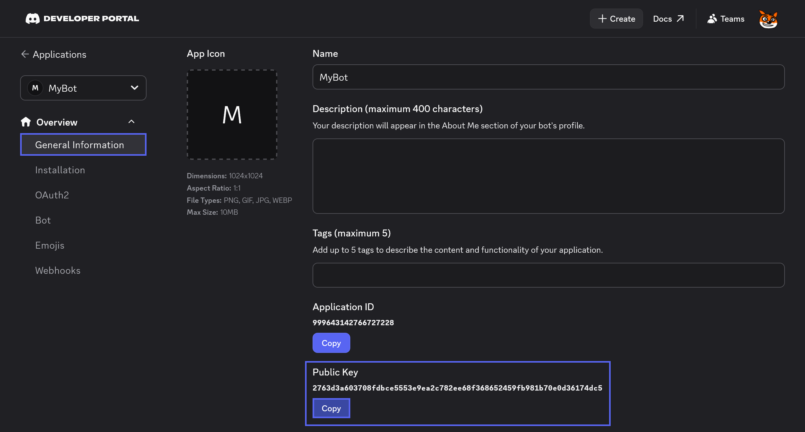
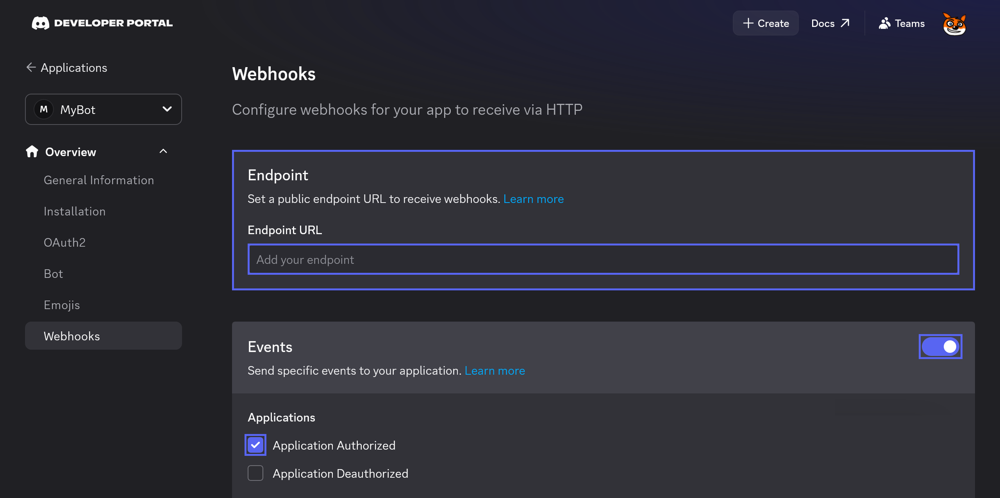

# Handling Webhook Events with ASP.NET Core

This guide will walk you through the process of receiving and handling Webhook Events from Discord in your application using the [NetCord.Hosting.AspNetCore](https://www.nuget.org/packages/NetCord.Hosting.AspNetCore) package.

## Required Dependencies

Before you get started, ensure that you've installed the necessary native dependencies. Follow the [installation guide](../installing-native-dependencies.md) to set them up.

## Setting Up

To receive Webhook Events from Discord, you need to use @NetCord.Hosting.Rest.RestClientServiceCollectionExtensions.AddDiscordRest* to add the @NetCord.Rest.RestClient and then call @NetCord.Hosting.AspNetCore.HttpEventEndpointRouteBuilderExtensions.UseWebhookEvents* to map the webhook events route and use @NetCord.Hosting.AspNetCore.WebhookHandlerServiceCollectionExtensions.AddWebhookHandler* to register handlers for specific webhook events.

[!code-cs[Program.cs](Introduction.WebhookEvents/Program.cs?highlight=8,20)]

You can inject any services from DI you want. You can also control the lifetime of the injected services by specifying the @Microsoft.Extensions.DependencyInjection.ServiceLifetime in the registration method. The default is @Microsoft.Extensions.DependencyInjection.ServiceLifetime.Singleton. See an example below:

[!code-cs[Delegate-based Webhook Event handler registration with lifetime](Introduction.WebhookEvents/WebhookHandlerExamples.cs#L12-L16)]

You can register class-based handlers. To do so, implement the @NetCord.Hosting.AspNetCore.IWebhookHandler interface of your choice and register the handler using @NetCord.Hosting.AspNetCore.WebhookHandlerServiceCollectionExtensions.AddWebhookHandler*.

[!code-cs[ApplicationDeauthorizedWebhookHandler.cs](Introduction.WebhookEvents/ApplicationDeauthorizedWebhookHandler.cs#L6-L15)]

Example registration:
[!code-cs[Class-based Webhook Handler Registration](Introduction.WebhookEvents/WebhookHandlerExamples.cs#L21)]

You can control the lifetime of the handler by specifying the @Microsoft.Extensions.DependencyInjection.ServiceLifetime in the registration method. The default is @Microsoft.Extensions.DependencyInjection.ServiceLifetime.Singleton. See an example below:

[!code-cs[Class-based Webhook Handler Registration with lifetime](Introduction.WebhookEvents/WebhookHandlerExamples.cs#L26)]

You can also register all public class-based handlers in an assembly using @NetCord.Hosting.AspNetCore.WebhookHandlerServiceCollectionExtensions.AddWebhookHandlers*.

[!code-cs[Registering all public class-based Webhook Handlers in an assembly](Introduction.WebhookEvents/WebhookHandlerExamples.cs#L31)]

You can also control the lifetime of the handlers by specifying the @Microsoft.Extensions.DependencyInjection.ServiceLifetime in the registration method. The default is @Microsoft.Extensions.DependencyInjection.ServiceLifetime.Singleton. See an example below:

[!code-cs[Registering all public class-based Webhook Handlers in an assembly with lifetime](Introduction.WebhookEvents/WebhookHandlerExamples.cs#L36)]

### Configuring Webhook Events

To make your app receive Webhook Events from Discord, you need to store the public key in the configuration, you can find it in the [Discord Developer Portal](https://discord.com/developers/applications). You will also need to enable Webhook Events and specify the endpoint URL there.

{width=850px}

#### Specifying the Public Key in the Configuration

You can for example use `appsettings.json` file for configuration. It should look like this:

[!code-json[appsettings.json](Introduction.WebhookEvents/appsettings.json?highlight=4)]

#### Enabling Webhook Events

You need to specify the endpoint URL and enable Webhook Events in the [Discord Developer Portal](https://discord.com/developers/applications) to make your app receive Webhook Events.
{width=850px}

If your application is hosted at `https://example.com` and you have specified `/webhooks` pattern in @NetCord.Hosting.AspNetCore.HttpEventEndpointRouteBuilderExtensions.UseWebhookEvents*, the endpoint URL will be `https://example.com/webhooks`. Also note that Discord sends validation requests to the endpoint URL, so your application must be running while updating it.

You also need to enable the events you want to receive in the 'Events' section.

### Specifying the Endpoint URL

If your app is hosted at `https://example.com` and you have specified `/webhooks` pattern in @NetCord.Hosting.AspNetCore.HttpEventEndpointRouteBuilderExtensions.UseHttpInteractions*, the endpoint URL will be `https://example.com/webhooks`. Also note that Discord sends validation requests to the endpoint URL, so your app must be running while updating it.

For local testing, you can use [ngrok](https://ngrok.com), a tool that exposes your local server to the internet, providing a public URL to receive interactions. Use the following command to start ngrok with a correct port specified:
```bash
ngrok http http://localhost:port
```

It will generate a URL that you can use to receive HTTP interactions from Discord. For example, if the URL is `https://random-subdomain.ngrok-free.app` and you have specified `/webhooks` pattern in @NetCord.Hosting.AspNetCore.HttpEventEndpointRouteBuilderExtensions.UseHttpInteractions*, the endpoint URL will be `https://random-subdomain.ngrok-free.app/webhooks`.

## Next Steps

Now that your application is set up to receive Webhook Events, you can expand its features or deploy it to cloud environments:

- **[AWS Lambda Deployment](aws-lambda.md):** Deploy your application to AWS Lambda for a serverless architecture.
- **[Azure Functions Deployment](azure-function.md):** Deploy your application to Azure Functions for scalable cloud hosting.
